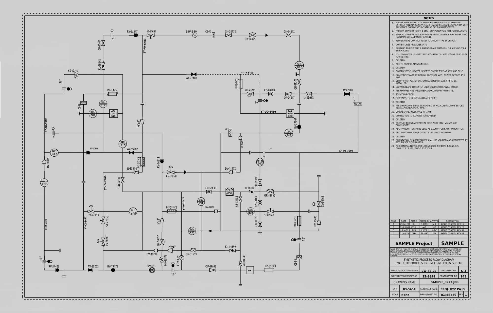
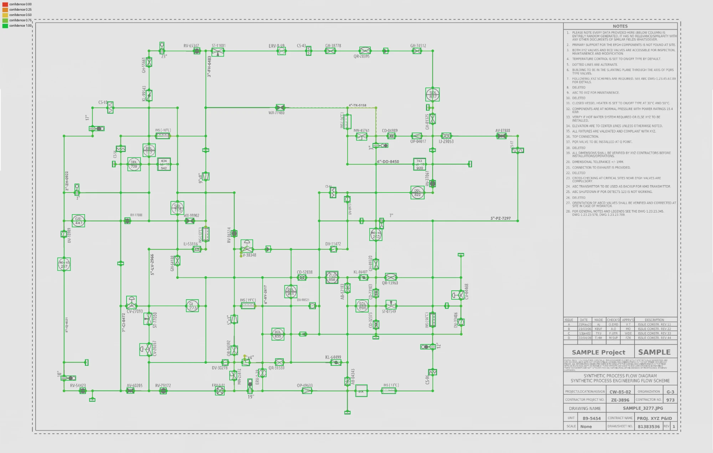

# DEXPI P&ID Viewer

A lightweight, dependency-free, single-page viewer and validator for **DEXPI 2.0.1** XML P&ID files.

- **Specification:** [DEXPI Specification 2.0.1](https://dexpi.org/specification/2.0.1/html/)
  - [DEXPI XML exchange format](https://dexpi.org/specification/2.0.1/html/basics/metamodel_and_exchange_format.html)
  - [Core model](https://dexpi.org/specification/2.0.1/html/models/Core/model-index.html) · [Plant model](https://dexpi.org/specification/2.0.1/html/models/Plant/model-index.html) · [Reference P&ID](https://dexpi.org/specification/2.0.1/html/appendix/reference_pid.html)

## Usage

Open `index.html` in a browser, then click **Open…** or drag a `.xml` file onto the canvas. Nothing is uploaded; parsing happens locally.

To use the **Sample** button or the `?file=` URL parameter, serve the folder (browsers block `fetch` from `file://`):

```bash
python -m http.server 8765
```

Then open `http://localhost:8765/?file=samples/dexpi_test.dexpi.xml`.

### Features

- **Topology view**: DEXPI conceptual data doesn't need drawing coordinates, so the viewer lays out the model from:
  - Pipes, using `SourceItem`/`SourceNode` → `TargetItem`/`TargetNode`
  - Segments that have no `Connections`, drawn as implied lines
  - Instrument sensing locations, measuring lines and signal lines
- **Layouts**: pick one from the toolbar.
  - **Flow (layered)**: Sugiyama-style, left to right along pipe direction. Best for process lines with consistent direction.
  - **Network (stress)**: stress majorization rotated to landscape, with overlaps removed. Best for meshes, such as digitized drawings whose pipe directions are arbitrary.
  - **Auto** (default): uses flow and switches to network for any connected group whose flow layout comes out badly proportioned.
- **Symbols** for equipment (tank, vessel, column, pump, heat exchanger), valves (operated, check, ball, globe, butterfly, safety), tees, reducers, flanges, off-page connectors, instrumentation functions and sensors. Any other component gets a generic symbol.
- **Inspector**: click a symbol to see its type, path, data, references, back-references and connections. Click a pipe to highlight its whole `PipingNetworkSystem`.
- **Validation panel**:
  - XML well-formedness, exchange-format structure, ID syntax and uniqueness, and IDREF resolution
  - With `metamodel.js` loaded: class existence and abstractness, declared properties, composition/reference/data kind, child and reference target types, and multiplicity bounds, all against the Core and Plant 2.0.1 metamodels
- **Model tree**, search by ID or tag (press Enter), toggles for instruments, unconnected items and labels, SVG export, and light/dark themes.

### Files

| Path | Purpose |
|---|---|
| `index.html` | The viewer (HTML/CSS/JS, no dependencies) |
| `metamodel.js` | Compact class table generated from DEXPI 2.0.1 `Core.xml` + `Plant.xml` (optional; enables metamodel checks) |
| `tools/validate.py` | CLI validator: XSD + metamodel checks (`pip install lxml`) |
| `tools/build_metamodel.py` | Regenerates `metamodel.js` from `tools/spec/` |
| `tools/spec/` | Official DEXPI 2.0.1 `DEXPI_XML_Schema.xsd`, `Core.xml`, `Plant.xml` |
| `samples/` | `dexpi_test.dexpi.xml` (pid-digitizer export of the drawing below) and the official DEXPI reference P&ID |
| `docs/` | Source drawing and digitizer detection overlay for the sample |

```bash
python tools/validate.py samples/dexpi_test.dexpi.xml
```

## Sample: `samples/dexpi_test.dexpi.xml`

`dexpi_test.dexpi.xml` is a pid-digitizer export of a synthetic P&ID (drawing `SAMPLE_3277.JPG`).

| Source drawing | Digitizer detections (colored by confidence) |
|---|---|
|  |  |

### Validation report

Both validators agree. The official reference P&ID passes with **0 errors**, which confirms the checks aren't over-reporting.

**XSD (DEXPI_XML_Schema.xsd): valid.** The file has 964 objects: 7 piping systems, 197 segments and pipes, 49 operated valves, 75 tees, 16 instrumentation functions and 31 sensors. All of them use existing concrete Plant/Core classes. Property names and kinds, child types, reference target types and upper bounds are all correct. Every IDREF resolves, and every ID is unique.

**Metamodel errors (3):** the `Core/EngineeringModel` header is missing three properties that are required (lower bound 1):

- `ExportDateTime`
- `OriginatingSystemVendorName`
- `OriginatingSystemVersion`

Only `OriginatingSystemName` is present. The fix is to add these elements to the `EngineeringModel` object:

```xml
<Data property="ExportDateTime"><DateTime>2026-10-06T00:00:00Z</DateTime></Data>
<Data property="OriginatingSystemVendorName"><String>…</String></Data>
<Data property="OriginatingSystemVersion"><String>…</String></Data>
```

**Content warnings.** These aren't violations, but they limit how closely the view can match the drawing:

- **No `Diagram` component.** The file carries none of the drawing's coordinates, so the viewer lays out the topology itself (the network layout, for this file). The detections were made at known positions, but those positions aren't exported.
- **No tags or labels.** None of the drawing's text made it into the file: valve tags such as `RV-65347` and `GH-38778`, instrument bubbles such as `DDL 117` and `SDL 715`, and line numbers such as `3"-FH-6483`. Its 16 `ProcessInstrumentationFunction`s also have no category, letters or number. Everything is labelled by generated ID (`Vl_s78`, `PIF_s87`).
- **Broken connectivity.** 58 pipes have only a `SourceItem`, and 8 have only a `TargetItem`. 31 `PipingNode`s are never referenced. Lines that run continuously in the drawing therefore end in open "line end" markers, and the grid of loops in the drawing comes out as a mostly tree-like network.
- **Everything is classified as `OperatedValve`.** Every valve is exported with this one class. Check valves, gate valves, safety valves, reducers and strainers aren't distinguished.

## Limitations

- `Core/Diagram` geometry (shapes, polylines, positions) isn't rendered. Files that include it are still shown as a topology view.
- Layout is automatic: it shows how items connect, not where they sit on the original drawing.

## License notice

The files in `tools/spec/` and `samples/reference_pid.dexpi.xml` come from the DEXPI Specification 2.0.1, © DEXPI, licensed under [CC BY 4.0](https://creativecommons.org/licenses/by/4.0/). `metamodel.js` is derived from them.
